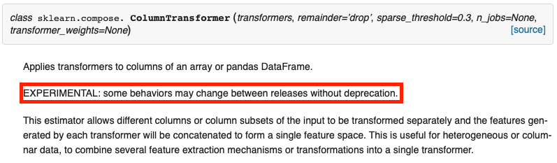
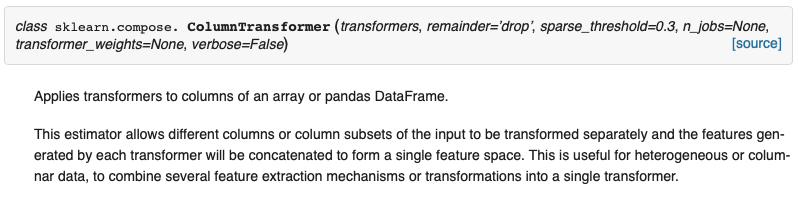

[.header: alignment(center)]

## Experimental Features in Scikit-learn

### Thomas J Fan - @thomasjpfan

#### scikit-learn core developer

---

## Experimental? 🔬

---

# ColumnTransformer in 0.20 🕵️‍♂️



---

# ColumnTransformer in 0.21 😅



---

## Is there a better way? 🤔

---

## Use enable\_\* 🤗

sklearn 0.21

```python
from sklearn.experimental import enable_hist_gradient_boosting
from sklearn.ensemble import HistGradientBoostingClassifier
```

---

## Upgrade to sklearn 0.22? 🛠

```python
from sklearn.experimental import enable_hist_gradient_boosting
from sklearn.ensemble import HistGradientBoostingClassifier
```

---

## Implementation ⁉️

---

## Implementation 🤯

```python
# sklearn/experimental/enable_hist_gradient_boosting.py
from ..ensemble._hist_gradient_boosting.gradient_boosting import (
    HistGradientBoostingClassifier,
    HistGradientBoostingRegressor)

from .. import ensemble

ensemble.HistGradientBoostingClassifier = HistGradientBoostingClassifier
ensemble.HistGradientBoostingRegressor = HistGradientBoostingRegressor
ensemble.__all__ += ['HistGradientBoostingClassifier',
                     'HistGradientBoostingRegressor']
```

---

# Experimental in 0.21

```python
from sklearn.experimental import enable_hist_gradient_boosting
from sklearn.ensemble import HistGradientBoostingClassifier

from sklearn.experimental import enable_iterative_imputer
from sklearn.impute import IterativeImputer
```

---

## Thank you! 😎

### @thomasjpfan

github.com/thomasjpfan/sklearn_experimental_talk
